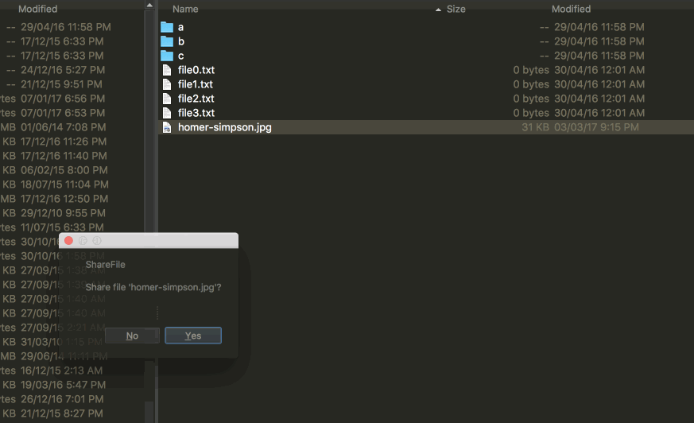

# ShareFile

ShareFile is plug-in for [fman](https://fman.io/) which allows you to share files 
with a URL. It uploads the file to [transfer.sh](https://transfer.sh/) and returns 
a sharable URL.

# Installation

On your OS from a terminal window, go to fman's plug-in folder:

Windows: 
> $ cd %APPDATA%\fman\Plugins

Mac: 
> $ cd ~/Library/Application Support/fman/Plugins

Linux: 
> $ cd ~/.config/fman/Plugins

Clone the repo:

> $ git clone https://github.com/umahmood/ShareFile.git

# Usage

1. Place the cursor over the file you want to share.
2. Press F9.
3. Confirm that you want to share the file.

You will get back a URL.

# License

See the [LICENSE](LICENSE.md) file for license rights and limitations (MIT).
